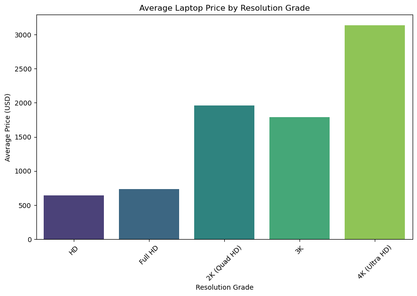

# Laptop Pricing Analysis & Visualization 💻📈  

Analyzes 991 laptops to understand how GPU type, secondary storage, and screen resolution impact pricing. Provides insights for consumers and manufacturers.

##  Project Overview
This project explores key factors influencing the price of laptops by analyzing various technical specifications and how they correlate with price differences. The goal is to uncover patterns and relationships that can:
- Help consumers make informed purchasing decisions.
- Provide insights for manufacturers on pricing strategies.
- Identify trends across different brands and specifications.

##  Research Questions
- How do different hardware features (e.g., GPU type, secondary storage, screen resolution) impact laptop pricing?
- Are certain features consistently associated with higher prices across different brands?
- Do specific brands follow distinct pricing strategies based on hardware specifications?

##  Dataset Description
The dataset consists of **991 distinct laptops** sourced from the "Smartprix" website. It contains **22 variables** detailing specifications such as:
- **Price (converted to USD)**
- **Brand & Model**
- **CPU brand & performance tier**
- **Number of cores & threads**
- **RAM capacity**
- **Primary & secondary storage types and capacities**
- **GPU type (integrated vs. dedicated)**
- **Screen size & resolution**
- **Touchscreen availability**
- **Operating system**
- **Warranty information**

###  Key Variables
| Variable Name      | Description |
|--------------------|-------------|
| `Price_USD`       | Price converted from INR to USD |
| `gpu_type`        | GPU classification (integrated, dedicated, Apple) |
| `sec_stor_type`   | Presence of secondary storage (SSD or None) |
| `res_grade`       | Classification of screen resolution |

###  Newly Created Columns
| Variable Name      | Description |
|--------------------|-------------|
| `Price_USD`       | Price converted from INR to USD |
| `gpu_type`        | GPU classification (Integrated, Dedicated, Apple) |
| `sec_stor_type`   | Presence of secondary storage (SSD or None) |
| `res_grade`       | Screen resolution category (HD, Full HD, 2K, 3K, 4K) |

##  Technologies Used
- **Python**
- **Pandas** for data manipulation
- **Matplotlib & Seaborn** for data visualization
- **Jupyter Notebook** for interactive analysis

##  Technical Highlights
- **Currency Conversion**: Prices were converted from INR to USD for better global understanding.
- **Feature Engineering**: Derived variables like `res_grade` (screen resolution classification).
- **Visualizations**: Created plots to analyze pricing trends across different brands and specifications.

##  Skills Demonstrated
- **Data Cleaning & Processing**: Manipulated laptop data efficiently.
- **Exploratory Data Analysis (EDA)**: Identified pricing trends and feature impacts.
- **Data Visualization**: Used various plots to convey insights.
- **Communication of Insights**: Clearly presented findings in an understandable and actionable way.

##  Future Improvements
- **Expand dataset** to include more laptops and additional years.
- **Incorporate real-world sales data** to compare listed prices with actual market trends.
- **Feature Importance Analysis** using machine learning models to determine key factors affecting pricing.

##  Acknowledgements  
- Dataset from [Kaggle](https://www.kaggle.com/datasets/bhavikjikadara/brand-laptops-dataset)  
- ChatGPT for code documentation assistance    

## 📎 Author
- **Michael Llaury** | 📅 *November 25, 2024*

---
